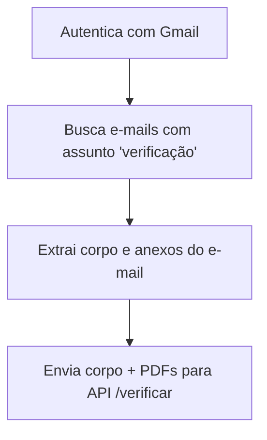

# Subprojeto `smart_email`

Este submódulo é responsável por **ler e-mails com anexos do Gmail**, extrair informações úteis (lista de verificação e documentos), e enviá-los para a API FastAPI (`/verificar`) para processamento. Ele será integrado ao sistema `smart-auditor-org`, focado em automação de auditoria documental.

---

## 📁 Estrutura Atual

```bash
smart_email/
├── email_reader.py                # Faz a leitura dos e-mails, autenticação e envio à API
├── enviar_em_lote.py              # Varre diretórios locais e envia arquivos à API FastAPI
├── fila_envio_assincrono.py      # Gera fila assíncrona e reenvio
├── testes/
│   └── test_fila_envio.py        # Teste que verifica se o envio em lote não gera erro
```

---

## 🔄 Fluxo Geral do `email_reader.py`



### Detalhes Técnicos:

* Utiliza `google-auth`, `google-api-python-client` e `python-dotenv`
* Armazena `token.json` localmente para reuso da autenticação
* Extrai `lista_verificacao` do corpo do e-mail
* Salva os arquivos PDF localmente e os envia como multipart para a API

---

## 🔁 Fluxo Geral do `enviar_em_lote.py`

* Percorre todos os diretórios dentro de `documentos/`
* Em cada diretório, procura por `lista_verificacao.txt` + arquivos PDF
* Envia ambos para o endpoint `/verificar`

### Log Esperado

```text
📁 11 conjuntos encontrados para envio.
📦 Processando conjunto: V01
✅ Enviado com sucesso.
```

---

## ✅ Testes Automatizados

Arquivo: `smart_email/testes/test_fila_envio.py`

```python
import pytest
from smart_email.enviar_em_lote import enviar_em_lote

def test_enviar_em_lote_nao_gera_excecao():
    try:
        enviar_em_lote()
    except Exception as e:
        pytest.fail(f"Erro ao executar enviar_em_lote: {e}")
```

Esse teste simples assegura que o script principal roda sem lançar erros.

---

## Próximos Passos

* [ ] Adicionar testes unitários com `mock` para API
* [ ] Tornar fila assíncrona com `asyncio.Queue`
* [ ] Isolar funções utilitárias em `utils/`
* [ ] Conectar com subprojeto `smart_core`
* [ ] Documentar com `docstrings` e `type hints`
